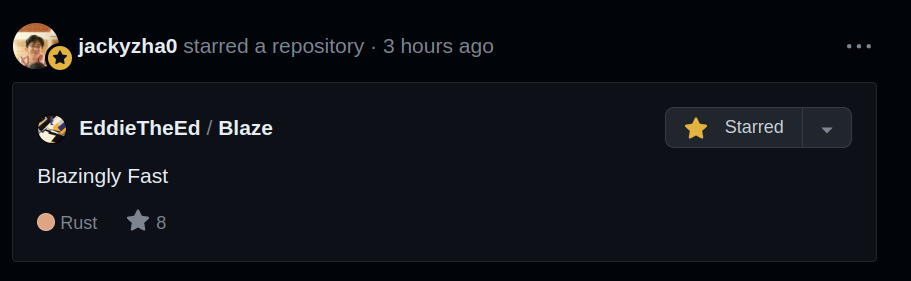

*This is crazy man, just crazy*

***

## Context

Let me set out the story. I wake up at 6. I'm preparing for spec cap. Before I leave home, I quickly check my Github. Cause maybe Jzhao[^1] has starred something cool today, like [the last thing he starred](https://spacetimedb.com/). And it turns out he has. I look at my phone and see the following (-2 hours, I took this picture later in the day):

At first, I was in disbelief. I was confused. It's that feeling you get when your casual routine, i.e. checking Github, is turned on its head. I'll be honest, I stared at my phone for a solid 10 seconds. Maybe even more. I just couldn't wrap my head around it. The legendary Jzhao, who basically inspired Blaze, giving his stamp of approval? Or interest. Who knows, I'm not gonna break down and analyse the meaning of starring things on Github. But regardless, the sense of joy and validation is immensely gratifying.

## Reaction

When I arrived at school, I showed [Ossac](https://github.com/notmario). We both agree that this was amazing, and we both feel immensely grateful that our wacky, poorly made passion project with big aspirations but little actual execution was graced with the honour of a star from Jzhao. As someone who has taken extreme motivation from Jzhao to embark on fun and playful projects, I simply can't describe how estatic I felt upon receiving the news. Sorry if this is sounding weird, but over the last year and a bit; since my journey into making websites for my school notes and other things, I have essentially been a loyal[^2] [Quartz](https://quartz.jzhao.xyz/) user, and have strived to explore, understand, and emulate the great work of Jzhao. 

## What now?

Don't think this is it. Just because Blaze has received one of the highest honours it could possibly receive, doesn't mean the work is not over. Because while Blaze is in a pretty good state, if I can attempt to say so without bias, there's so many features I want to add. Blaze takes the majority of its inspiration from Quartz, but there's still things that are **personally important to me**, and I want to see Blaze to its end. When I actually, legitimately, release Blaze as a "finished product", I want it to be something I'm proud of.

On a personal note, for the people who I see almost every day, the image above is gonna be my background for at least a week. Sorry Pranav.

## Summary

Dear Jzhao,

We don't know each other that well. We've never spoken face to face, or even talked to each other. But I want you to know, I'm not exaggerating when I say that you starring something that I worked on is one of the greatest honours of my life. You have provided me a great boost in motivation and further inspiration throughout the past year and a bit, and I cannot quantify my gratitude to receive your star. I'm confident that Ossac feels the same way. We've both just pleasantly surprised and a little baffled.

Sorry if I'm being way too verbose/obsessed with the star. It's just that this is something I couldn't possibly dream would happen in my lifetime.

*With love(not weird, i sign most things off with this, trust me),*

*Ed*

[^1]: By the way, is it Jzhao, or JZhao, or just jzhao? I've defaulted to Jzhao cause I feel such a name deserves the respect of a capitalised first letter, but I don't actually know which is preferred.
[^2]: Ehhh... At weak points during that time, I almost switched to Jekyll. And I start into this whole thing was some long forgotten Obsidian notes $\implies$ website thingy that used Netlify. I'd link it here, but I've legitimately forgotten what it was called.
