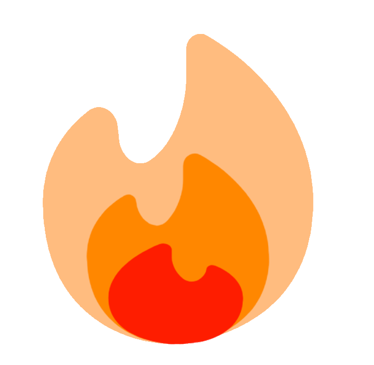

*the reasoning: quartz == igneous == ignite == fire == blazingly fast™*

> [!quote] Definition  
> 
> A white paper is an authoritative report or guide that often addresses issues and how to solve them. White papers are used to educate readers and help people make decisions.
> 
> - Wikipedia, 00:50, 16 November 2009 (yes i checked the logs)

(callouts to be fixed later(lol))

## TLDR
**Blaze** is a *Markdown* parser / static site generator written in *Rust* that creates a static site, to be used however you like! (hopefully nothing illegal).

## Preface
### Definitions
**Blaze** $\implies$ The [project](https://github.com/EddieTheEd/Blaze) for which this whitepaper refers to, a Markdown parser written in Rust to make websites "blazingly fast".

**User** $\implies$ The individual who uses the source code for Blaze

### Contributions
This project was made by [Ed](https://github.com/EddieTheEd), with massive help ~~he wrote literally 99.99999% of the rust code~~ from [Ossac](https://github.com/notmario).

[Tag](https://github.com/Grim4Reaper) is a "collaborator", but he hasn't done anything. :/

### Inspiration
Blaze's links graph(to be added) is heavily inspired by the [Jzhao's](https://jzhao.xyz/) work on [Quartz](https://github.com/jackyzha0/quartz), which runs on [Hugo](https://gohugo.io/). 

I made Blaze because I wanted to essentially make my own version of Quartz, initially intended to be written in [Jekyll](https://jekyllrb.com/), but thanks to Ossac it is instead made from [Rust](https://www.rust-lang.org/).

The idea for sidenotes (to be added) is inspired from [Dave Liepmann's](https://www.daveliepmann.com/) work on [Tufte-CSS](https://edwardtufte.github.io/tufte-css/), which itself stems from the "distinctive style" of the "revolutionary retina of our time", [Edward Tufte](https://www.edwardtufte.com/tufte/).

## Reasoning

Blaze is built under the following principles:

1. **Knowledge should be free and widely accessible.** 
	- What this means is that Blaze does not include ways to add paywalls on the resultant websites it makes. 
	- If someone wants to do that, by all means they can, but that is not what Blaze was designed for.
2. **Knowledge should be presented however the user likes.** 
	- There's no one style of a website that fits everyone's taste. That's why Blaze offers a "whopping"(2) range of different "themes" for the website, including a minimalist theme. 
	- However, most work goes into the default theme.
3. **Knowledge should be expressed in an *expressive* ~~and vibrant~~ format.** 
	- This makes it more engaging and more effectively learnt.
4. **Knowledge that crosses the line between informative and personal should be hidden at the discretion of the user.**
	- While knowledge should be free, users should not feel forced to liberate their personal information into the wild. 
	- This can include, and not be limited to, their *actual* personal details (address, name, credit card number(but seriously if you are gonna do that you're a little goofy)) or works that the user deems personal by their own standards. 
	- Blaze is not trying to impart any standards on the user, and simply hands them the tool to make the choice for themselves.

## Roadmap

### 2023-07-26
- White paper made

### 2023-08-18
- [Starred by Jzhao](https://github.com/EddieTheEd/Blaze/stargazers)!!!!!!

## Plans
### Essential
- ~~Functional TOC~~
    - Have the TOC work for more than just h2 and h3. All I need to do is just modify the logic. Should be pretty simple. But I've been putting it off. I think the best way to approach it is to create a file that essentially tests the TOC. From there, I can look at the problem from a better perspective and see how the logic is going to work. This has surprisingly become a rather interesting question with regards to comp sci in general.
- ~~Actually add the graph~~
- ~~Actually add the sidenotes~~
- **Frontmatterification**
	- ~~Fix current bugs~~
	- ~~Description displayed below title~~
	- CSS changes via frontmatter
	- **draft: true prevents the page from being made**
- ~~Fix formatting for callouts to align with the standard~~
- Make repository into display of all features, breaking down code
    - Much like how [Quartz](https://quartz.jzhao.xyz/) does it.
    - Shouldn't be too technical, someone like me at the start of this whole thing should be able to understand and learn from it.
- **Extreme Customisability using blazeconfig.toml**
    - Able to use or not use things like Mathjax directly from blazeconfig.toml
    

### Less important
- Spruce up Backlinks
- Multi-device layouts
    - Should be a simple fix with css. Nothing too hard I hope.
- Graph full screen mode(like how Quartz does it, looks very hot 👍)
- x min read on top (literally stolen from Quartz)

### Distant
- Full-text search
	- Optional natural language search??!?
- More themes! [~~Jacaranda~~ Dracula](https://nottacoz.github.io/jacaranda/) theme potentially?
- ~~Light dark mode~~ never, dark mode is superior
    - Just kidding. But I think I'll implement it differently to how Quartz does it. Instead of just a light and dark mode button, I think I might instead have a "settings" button, where the user can make personalisations to the way they view the Blaze website, stored locally of course.
- Search for pathing
	- Breadth-first search :(
- SPA???
    - Maybe. I have bad memories with SPA from Quartz :( but it makes things faster, and I should be able to implement this alongside with changes to the frontmatter.
    - i.e. If the theme of a page is "dracula", for example, this should still be loaded regardless of whether Blaze is configered to be a SPA or not.

## Miscellaneous
### Donating
Uhh this is a weird topic, which is why I put it in miscellaneous. So, Github has a sponsoring thing, for example you can sponsor [Jacky Zhao, creator of Quartz](https://github.com/sponsors/jackyzha0), or [Aiden Bai, creator of Million.js(awesome)](https://github.com/sponsors/aidenybai). Now. And I *really* want to emphasis this.

**You do not need to donate anything! For the foreseeable future, all code I work on as a hobby will be free and open source.**

In fact, if there's anyone you should sponsor, its [Ossac](https://github.com/notmario), who's hard carrying this whole project.  

But if you do donate to me, umm thanks I guess? Just know all the money will go towards buying [this exact brand of blue pea tea](https://www.spafoods.com.sg/products/blue-pea-flower-tea-with-manuka-honey).

### Why not use Quartz?
You should use Quartz. It's definitely way more well-made, polished and has a great, supportive community. The goal of Blaze is not to surpass or even come close to the quality of Quartz, but instead to be a personal passion project made open source so others can use it. Yeah. Enjoy :)  

### Can I be a contributor?
Absolutely! If you have something cool to add to the project, just make a pull request. If it works on your machine, it should work on mine and Ossac's as well.  

### Can I use the code under a non-free(proprietary) license?
Blaze is actually licensed under the [Unlicense](https://en.wikipedia.org/wiki/Unlicense)[^1], as shown in the [repository file](https://github.com/EddieTheEd/Blaze/blob/main/LICENSE). Although I don't suggest you should do something like redistributing the code under a proprietary or commercial license, I don't really have much a say in it. I mean, why on earth would you do such a thing for this kind of project anyways?  

Anyways, go ham I guess?  

### Can I suggest ideas?
Absolutely! Email me at [ed@toomwn.xyz](mailto:ed@toomwn.xyz), or dm me on Discord, my username is "definitelyeddie.".

Ideas are welcome, but please do not spam my Discord or email, and I (or Ossac) don't have to implement any ideas suggested.  

[^1]: should've been the [dwtfywtpl](https://en.wikipedia.org/wiki/WTFPL) -- ossac
