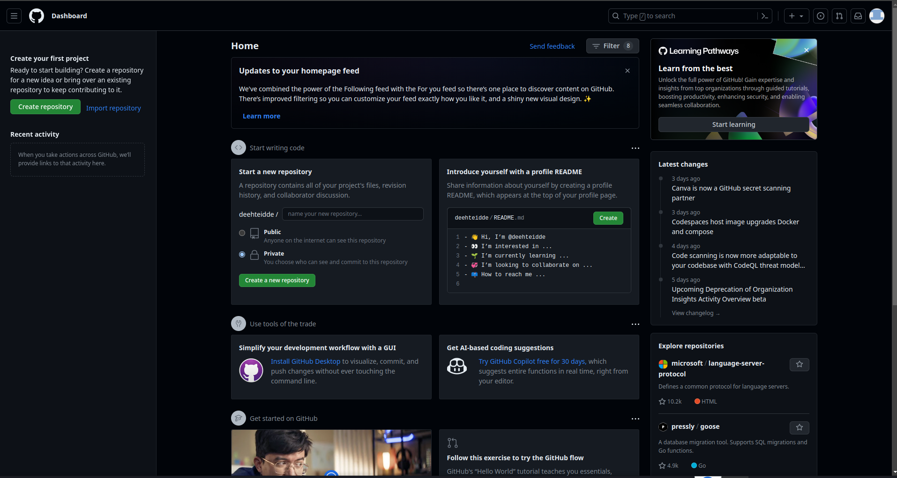
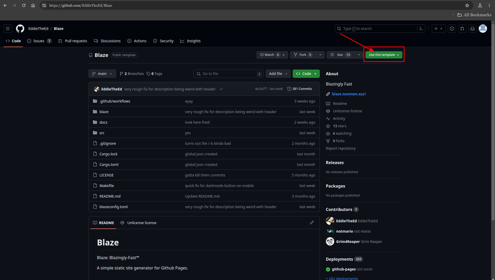
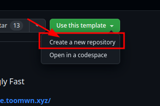
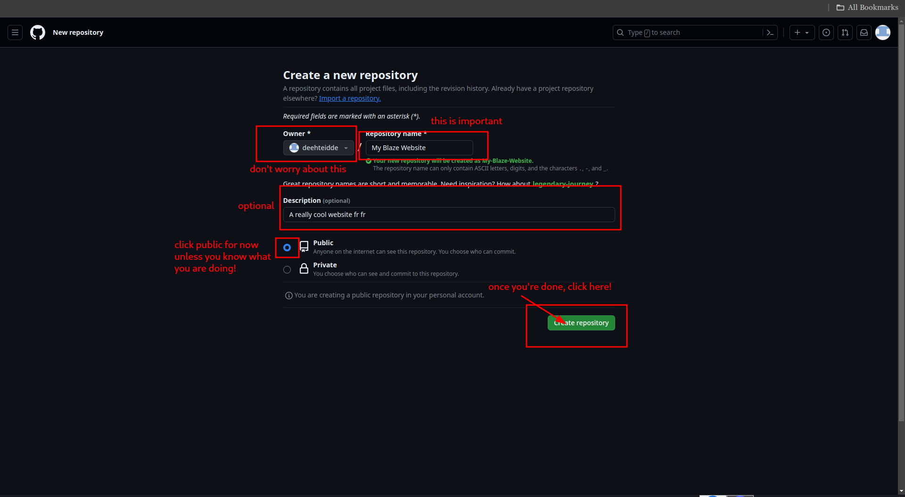
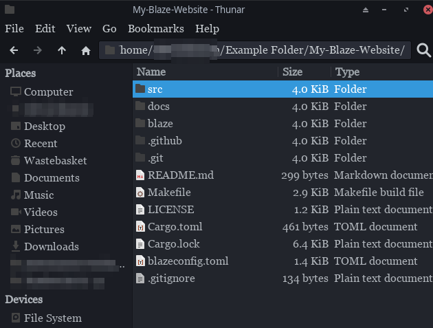
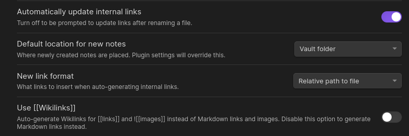
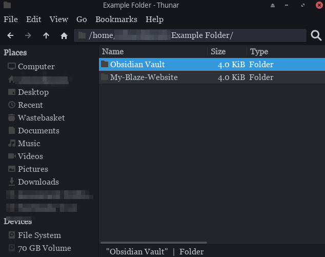
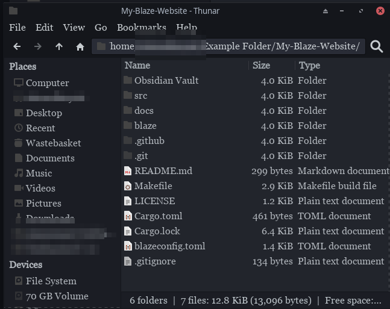

Before you start using Blaze, you probably need to set up a few other things first.

## Github
1. Most importantly of all, you **need** a *Github account*. Here is mine. (totally)

2. Once you have a Github account, you can go to the [Blaze github](https://github.com/EddieTheEd/Blaze) and click the `Use this template` button. Then, select the `Create a new repository` option.

3. Once you've done that, you should be looking at something like this. Fill out the fields as required. Note that private repositories mean that the source code can be accessed online, but this means *Github pages* (what Blaze uses to host the website) will **not** work. if you want to use a private repository, see [here](privaterepo.md).

4. Now you should be seeing the *Github repository* for your website. If you chose the `Public` option, anyone can access this URL. Now select the `Code` button and **clone** this new repository via `HTTPS` or `SSH`. [^1]

5. Check that you have cloned it successfully by opening the repository folder. It should look something like this.

## Adding content
First, we should configure Obsidian[^2] , if you plan to use it.
### Obsidian
Configure your Obsidian vault settings as follows. The most important setting is absolute pathing and no wikilinks. [^3]

### I have an existing obsidian vault
Say your files look something like this. (Your Obsidian vault doesn't literally have to be called `Obsidian Vault`)

All you need to do is simply move the `Obsidian Vault` folder into the repository folder. You can also delete the `docs` folder if you want, because that is for the [blaze.toomwn.xyz website](https://blaze.toomwn.xyz/).

Next, you need to change the `blazeconfig.toml` file.
Go to the `build` section and change the string of the `input` option to **the name of your Obsidian Vault**. In this example, I would have to change it to `'Obsidian Vault'.`

Now you're done! Open the new folder as a vault and your Obsidian stuff should be there.
### I want to make a new vault
1. Go into the Blaze folder, as above.

2. Create a new folder, and name it to what you want your Obsidian vault to be called. For example, in the image below I have named mine `Obsidian Vault`.

3. Now open Obsidian and click the `Create` button, then navigate to the named folder inside the `Blaze` folder.

4. Next, you need to change the `blazeconfig.toml` file. Go to the `build` section and change the string of the `input` option to **the name of your Obsidian Vault**. For example, I would have to change it to `'Obsidian Vault'.`

Now you're done!

[^1]: If you are unaware how to clone repositories, see [here](https://docs.github.com/en/repositories/creating-and-managing-repositories/cloning-a-repository).
[^2]: If you haven't installed it already [go here](https://obsidian.md/).
[^3]: This is because Blaze creates links relative to the file.. ~~Also, Blaze is designed to **only** read [markdown links](https://www.markdownguide.org/basic-syntax/), while Obsidian tends to default to [wikilinks](https://en.wikipedia.org/wiki/Help:Link).~~ This may be fixed(maybe)
