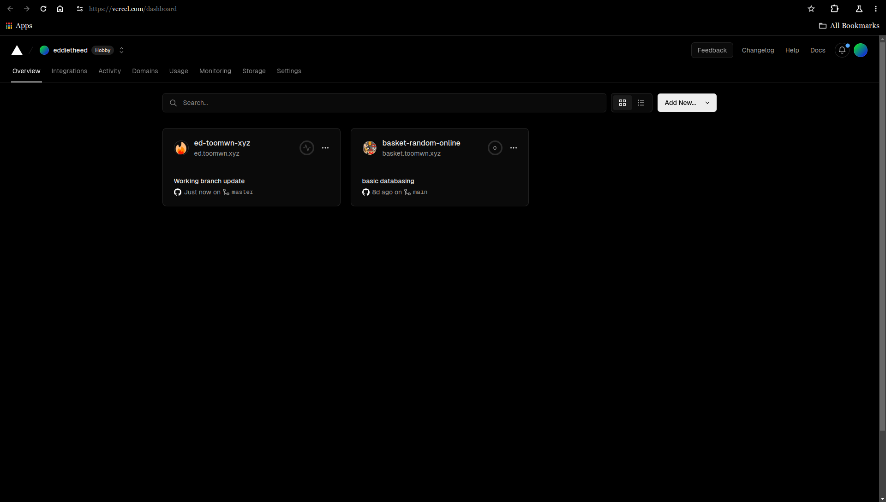
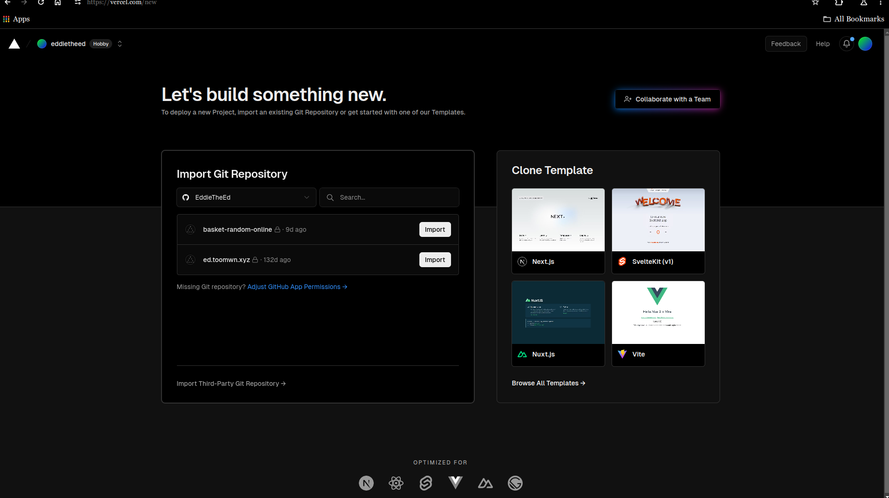
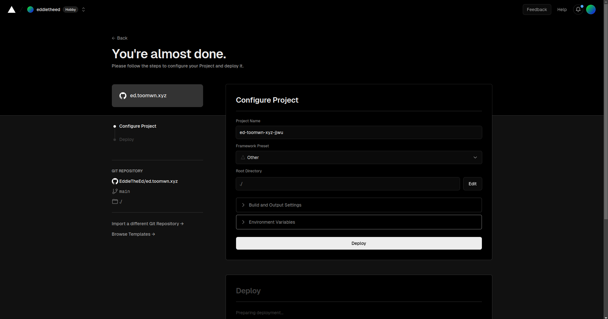
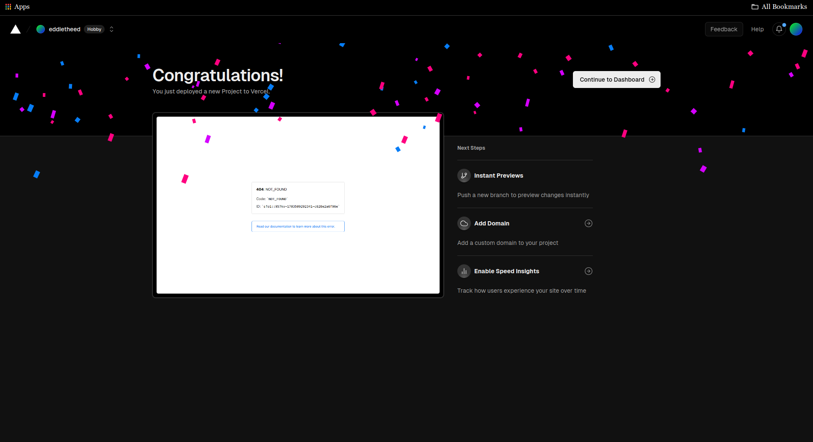
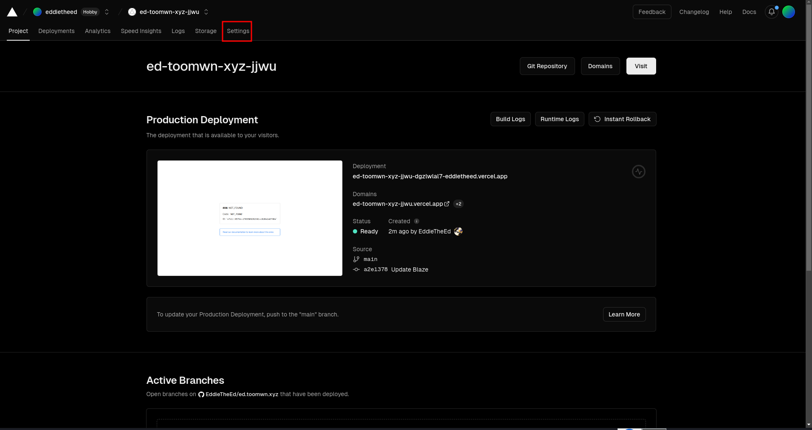
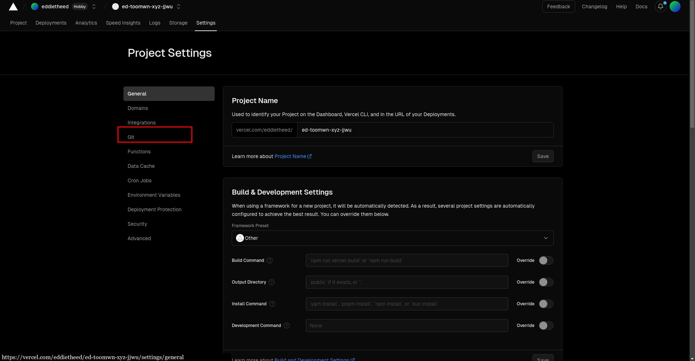
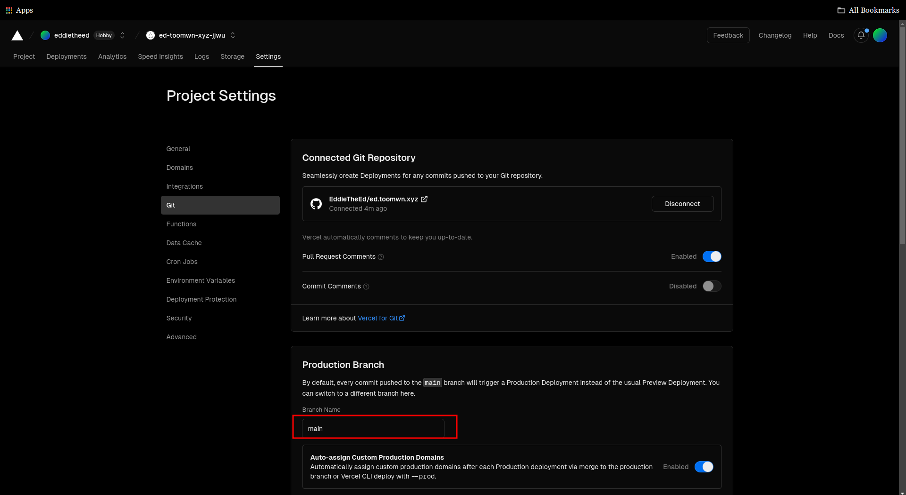
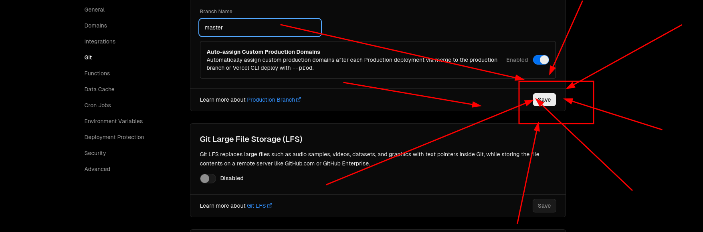
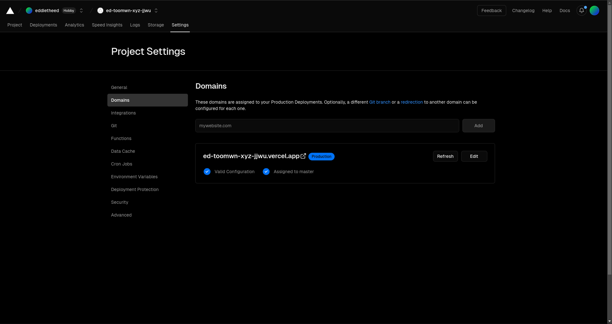

Say you want to keep the source code to your website private. Maybe you want more control over the content, maybe you made some modifications to the code that you want to be kept private. Don't worry, Blaze can work with private repos!

Not to toot my own horn, but my personal website ([ed.toomwn.xyz](https://ed.toomwn.xyz/)) uses a private repo.

As you can probably guess, the way I did it(and the way I suggest to do it) is to use [Vercel](https://vercel.com/).

## Starting with Vercel

I'm not going to instruct you on how to make a Vercel account. So I'm going to assume either you have one, or you have made one. If so, if you go to the [Vercel dashboard](https://vercel.com/dashboard), it should look something like this.

Now, we are going to select the `Add New` button, then choose `Project`.

You should then get something like this:

Now, import your website's repository from Github. Follow the instructions on the screen.

Once this is done, you will get this final configuration page.

You should not need to change anything. Make sure it looks something like this.

Select the `Deploy` option.

Once the initial deployment is done, you should get something like this. 

Now, press the `Continue to dashboard` button.

If you go to the deployed website's URL, you'll notice it's a 404 page. This is because it deployed the `main` branch, and not the `master` branch, where Blaze does its magic.

Open the `Settings` for the project.

Select the `Git` option.

Now, we are going to change the production branch from `main` to `master`. You will have to type 'master' into the box, replacing 'main'.

Don't forget to press `Save`!!!

Now, the next time you push to the `main` branch, and Blaze subsequently updates the `master` branch, Vercel will now deploy the website!

## Custom domain

Go to the `Domains` section of the `Settings` for the Vercel project.

Add the domain and configure it following the instructions your domain name registrar provides. 

Vercel should now deploy to your custom domain as well. as to "{{your website name}}.vercel.app" .
